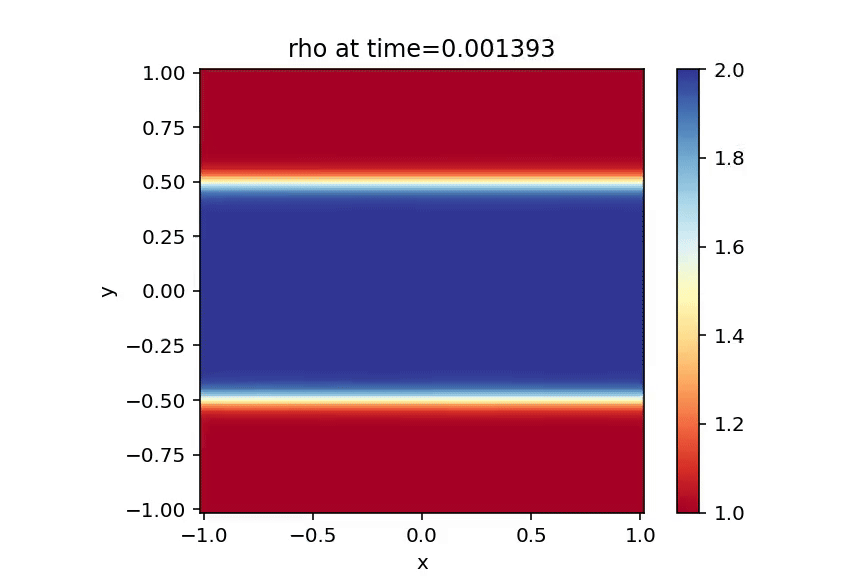

# 2D Hydrodynamics Solver and Kelvin–Helmholtz Instability

A two-dimensional compressible hydrodynamics solver written in Python, together with an application to the **Kelvin–Helmholtz instability**.

The project was developed to explore the numerical solution of the Euler equations and the emergence of hydrodynamic instabilities from simple initial conditions.

The solver evolves density, momentum, and total energy on a Cartesian grid and includes several numerical advection schemes, configurable boundary conditions, CFL-controlled adaptive timesteps, and optional artificial viscosity.

The Kelvin–Helmholtz simulation demonstrates the development of vortical structures from initially small perturbations at the interfaces between fluid layers moving with different velocities.

---

## Physical Model

The code evolves the two-dimensional compressible Euler equations.

The conserved variables are

$$
Q_1 = \rho,
$$

$$
Q_{2,x} = \rho u_x,
$$

$$
Q_{2,y} = \rho u_y,
$$

and

$$
Q_3 = \rho e_{\mathrm{tot}},
$$

where

$$
e_{\mathrm{tot}} = e_{\mathrm{int}} + \frac{1}{2}\left(u_x^2 + u_y^2\right).
$$

The fluid is assumed to obey an ideal-gas equation of state,

$$
p=(\gamma-1)\rho e_{\mathrm{int}}.
$$

---

## Numerical Method

The solver uses an operator-splitting approach in which advection of the conserved quantities and pressure contributions are treated separately.

For the two-dimensional advection, directional Strang splitting is used:

$$
A_x(\Delta t/2)
\rightarrow
A_y(\Delta t)
\rightarrow
A_x(\Delta t/2).
$$

The timestep is dynamically determined from the Courant–Friedrichs–Lewy (CFL) condition using the maximum local characteristic velocity,

$$
|u|+c_s,
$$

where \(c_s\) is the local sound speed.

### Advection schemes

Several numerical advection schemes are available:

* First-order upwind / donor-cell
* Lax–Wendroff
* Beam–Warming
* Fromm
* Minmod
* Superbee
* Monotonized Central (MC)
* van Leer

### Boundary conditions

The solver supports several ghost-cell boundary conditions:

* Reflective
* Periodic
* Free outflow/inflow
* Free outflow without artificial inflow

### Artificial viscosity

An optional von Neumann–Richtmyer-type artificial bulk viscosity is implemented. It acts only in regions of compression and can be used to introduce additional numerical dissipation around steep compressive features.

---

# Kelvin–Helmholtz Instability

The Kelvin–Helmholtz instability develops at the interface between fluids moving with different tangential velocities.

The simulation initializes a denser central layer surrounded by two lower-density layers.

The density varies smoothly from approximately

$$
\rho=1
$$

in the outer layers to

$$
\rho=2
$$

inside the central layer.

The central layer initially moves in the positive \(x\)-direction,

$$
u_x \approx +1,
$$

while the surrounding fluid moves in the opposite direction,

$$
u_x \approx -1.
$$

The transitions are smoothed using hyperbolic-tangent profiles rather than introducing discontinuous interfaces.

A small vertical velocity perturbation is introduced around the two shear interfaces:

```math
u_y = A \sin\left(\frac{2\pi n(x-x_{\min})}{L_x}\right)
\left[
\exp\left(-\frac{(y-y_0)^2}{\sigma^2}\right)
-
\exp\left(-\frac{(y+y_0)^2}{\sigma^2}\right)
\right]
```

This perturbation seeds the instability. As the simulation evolves, the initially small perturbations grow and produce the characteristic vortical structures associated with the Kelvin–Helmholtz instability.

The default simulation uses periodic boundary conditions in both directions.

---

## Default Kelvin–Helmholtz Setup

The default parameters are approximately:

| Parameter                |                  Value |
| ------------------------ | ---------------------: |
| Grid                     |       $$250\times250$$ |
| Domain                   | $$[-1,1]\times[-1,1]$$ |
| Adiabatic index          |         $$\gamma=1.4$$ |
| Initial pressure         |              $$p=2.5$$ |
| Outer density            |             $$\rho=1$$ |
| Central density          |             $$\rho=2$$ |
| Velocity magnitude       |              $$u_0=1$$ |
| Shear interfaces         |           $$y=\pm0.5$$ |
| Transition width         |               $$0.05$$ |
| Perturbation amplitude   |              $$A=0.1$$ |
| Perturbation modes       |                $$n=2$$ |
| Perturbation width       |        $$\sigma=0.12$$ |
| CFL number               |                $$0.5$$ |
| Boundary conditions      |               Periodic |
| Default advection scheme |               van Leer |

---

## Repository Structure

```text
.
├── Classic_Hydro_Solver_2D.py
├── KH_Instability.py
├── Advection_Schemes.py
└── README.md
```

`Classic_Hydro_Solver_2D.py` contains the main two-dimensional hydrodynamics solver.

`Advection_Schemes.py` contains the numerical advection schemes and flux limiters used by the solver.

`KH_Instability.py` defines the initial conditions for the Kelvin–Helmholtz problem and runs the hydrodynamics solver.

---

## Running the Simulation

The project requires Python 3 together with NumPy and Matplotlib. FFmpeg is used to generate videos from the simulation frames.

Run the Kelvin–Helmholtz simulation with

```bash
python KH_Instability.py
```

The default parameters produce a \(250\times250\) simulation using the van Leer scheme.

Parameters such as grid resolution, CFL number, boundary conditions, artificial-viscosity strength, simulation time, and numerical scheme can be modified through the `kh_instability()` function.

For example,

```python
kh_instability(
    Nx=250,
    Ny=250,
    tend=5.0,
    CFL=0.5,
    viscosity=True,
    Xi=3.0,
    bound_cond="periodic",
    scheme="vanLeer"
)
```

---

## Output

During the simulation, the solver produces visualizations of

* density: $\rho$,
* velocity magnitude: $|\mathbf{u}|$,
* specific total energy: $e_{\mathrm{tot}}$,
* pressure: $p$.

The generated frames are combined into MP4 videos using FFmpeg.

---

## Example Result

The density evolution shows the growth of the initially imposed perturbation at the two shear interfaces. The perturbations progressively distort the interfaces and develop into the characteristic vortical structures of the Kelvin–Helmholtz instability.



[Watch the full MP4 simulations](media/)

---

## Numerical Considerations

This project is primarily intended as a non-professional scientific-computing implementation of two-dimensional compressible hydrodynamics.

The current solver separates advective transport from the pressure terms through operator splitting. This approach works well for the Kelvin–Helmholtz application shown here, but very strong shocks can require more robust conservative shock-capturing methods.

The implementation was developed from scratch in Python as a numerical hydrodynamics project.

---

## Author

**Santiago Hernández Díaz**

PhD candidate in Physics
University of Tübingen
